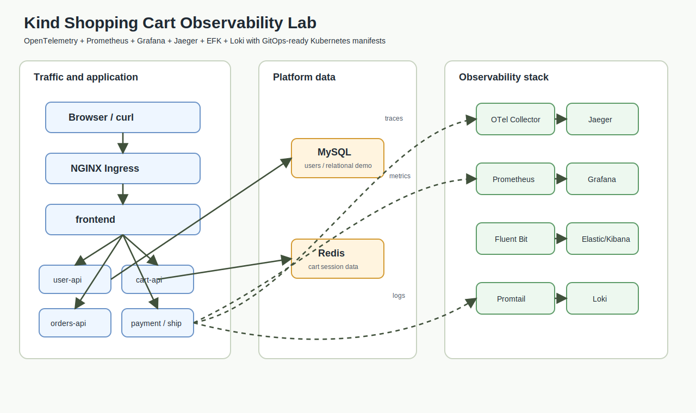

# Kubernetes Observability Project with Kind, OpenTelemetry, EFK, Loki, Prometheus, Grafana, and Jaeger

This project runs a microservices shopping platform on a Kind Kubernetes cluster and connects it to:

- `frontend`
- `user-api`
- `cart-api`
- `orders-api`
- `payment-api`
- `shipping-api`
- Redis for cart data
- MySQL for user/order-style relational data

- OpenTelemetry Collector for trace collection
- Jaeger for distributed tracing
- EFK stack: Elasticsearch, Fluent Bit, and Kibana for logs
- Prometheus for metrics and PromQL
- Loki + Promtail for log aggregation and LogQL
- Grafana for Prometheus metrics, Loki logs, and Jaeger traces
- Optional Argo CD GitOps deployment and error-recovery labs

New to observability? Start with the latency runbook:

```text
docs/LATENCY-TROUBLESHOOTING.md
```

Preparing for interviews? Use:

```text
docs/INTERVIEW-PREP.md
interview-code/
```

CI security scanning notes:

```text
docs/CI-SCANNING.md
```

Rancher-style phase-by-phase diagrams:

```text
docs/RANCHER-PHASE-DIAGRAMS.md
```

## Architecture



```text
curl/browser
   |
   v
frontend service
   |
   v
frontend pod
   |
   +--> user-api -> MySQL
   +--> cart-api -> Redis
   +--> orders-api
   +--> payment-api
   +--> shipping-api

All app pods
   |                         |                       |
   | OTLP traces             | /metrics              | stdout logs
   v                         v                       v
OpenTelemetry Collector      Prometheus              Fluent Bit -> Elasticsearch -> Kibana
   |                         |                       |
   v                         v                       v
Jaeger                       Grafana                 Promtail -> Loki -> Grafana
```

## Prerequisites

Install these tools:

- Docker
- Kind
- kubectl

Check them:

```bash
docker --version
kind --version
kubectl version --client
```

## Step 1: Create a Kind Cluster

Create a cluster named `observability`:

For ingress access from your browser, use the included Kind config instead:

```powershell
kind create cluster --config .\kind-config.yaml
```

Then install the NGINX ingress controller:

```powershell
For the clean/proper setup, recreate the cluster with your config:
kind delete cluster --name observability
kind create cluster --config .\kind-config.yaml
kubectl apply -f https://raw.githubusercontent.com/kubernetes/ingress-nginx/controller-v1.11.1/deploy/static/provider/kind/deploy.yaml
kubectl wait --namespace ingress-nginx --for=condition=ready pod --selector=app.kubernetes.io/component=controller --timeout=180s

For a quick temporary workaround without recreating:

kubectl -n ingress-nginx port-forward svc/ingress-nginx-controller 8080:80
```

Add the entries from `scripts\hosts-entries.txt` to your Windows hosts file if you want browser URLs like `http://shop.observability.local`.

Confirm the cluster is running:

```bash
kubectl cluster-info --context kind-observability
kubectl get nodes
```

If you already have a Kind cluster, make sure `kubectl` points to it:

```bash
kubectl config use-context kind-observability
```

## Step 2: Build the Application Docker Image

From this project folder, build all local service images:

```bash
docker build -t orders-api:local ./app
docker build -t shopping-frontend:local -f ./services/frontend/Dockerfile .
docker build -t user-api:local -f ./services/user-api/Dockerfile .
docker build -t cart-api:local -f ./services/cart-api/Dockerfile .
docker build -t payment-api:local -f ./services/payment-api/Dockerfile .
docker build -t shipping-api:local -f ./services/shipping-api/Dockerfile .
```

On Windows PowerShell, you can build and load all local images in one step:

```powershell
.\scripts\build-load-kind.ps1
```

## Step 3: Load the Image into Kind

Kind does not automatically see images from your local Docker engine. Load the image into the Kind cluster:

```bash
kind load docker-image orders-api:local --name observability
kind load docker-image shopping-frontend:local --name observability
kind load docker-image user-api:local --name observability
kind load docker-image cart-api:local --name observability
kind load docker-image payment-api:local --name observability
kind load docker-image shipping-api:local --name observability
```

Verify the image is available inside the Kind node:

```bash
docker exec -it observability-control-plane crictl images | grep orders-api
```

On Windows PowerShell, use:

```powershell
docker exec -it observability-control-plane crictl images | Select-String orders-api
```

## Step 4: Deploy the Project

Deploy the namespace, app, OpenTelemetry Collector, Jaeger, Elasticsearch, Fluent Bit, Kibana, Prometheus, Loki, Promtail, and Grafana:

```bash
kubectl apply -k ./k8s
```

If you want one command for the full Kind lab, including cluster creation, ingress, image build/load, and Kubernetes apply:

```powershell
.\scripts\start-kind-full.ps1
```

Check all pods:

```bash
kubectl get pods -n observability-demo
```

Wait for the main deployments:

```bash
kubectl wait --for=condition=available deployment/frontend -n observability-demo --timeout=180s
kubectl wait --for=condition=available deployment/user-api -n observability-demo --timeout=180s
kubectl wait --for=condition=available deployment/cart-api -n observability-demo --timeout=180s
kubectl wait --for=condition=available deployment/orders-api -n observability-demo --timeout=180s
kubectl wait --for=condition=available deployment/payment-api -n observability-demo --timeout=180s
kubectl wait --for=condition=available deployment/shipping-api -n observability-demo --timeout=180s
kubectl wait --for=condition=available deployment/mysql -n observability-demo --timeout=300s
kubectl wait --for=condition=available deployment/redis -n observability-demo --timeout=180s
kubectl wait --for=condition=available deployment/otel-collector -n observability-demo --timeout=180s
kubectl wait --for=condition=available deployment/jaeger -n observability-demo --timeout=180s
kubectl wait --for=condition=available deployment/elasticsearch -n observability-demo --timeout=300s
kubectl wait --for=condition=available deployment/kibana -n observability-demo --timeout=300s
kubectl wait --for=condition=available deployment/prometheus -n observability-demo --timeout=180s
kubectl wait --for=condition=available deployment/loki -n observability-demo --timeout=180s
kubectl wait --for=condition=available deployment/grafana -n observability-demo --timeout=180s
```

Check Fluent Bit and Promtail:

```bash
kubectl get daemonset fluent-bit -n observability-demo
kubectl get daemonset promtail -n observability-demo
```

## Step 5: Test the Shopping Cart Application

Port-forward the app service:

```bash
kubectl port-forward svc/frontend 8080:8080 -n observability-demo
```

Open another terminal and send traffic:

```bash
curl http://localhost:8080/
curl http://localhost:8080/home
curl http://localhost:8080/checkout-demo
```

You can also test individual APIs:

```bash
kubectl port-forward svc/orders-api 8081:8080 -n observability-demo
kubectl port-forward svc/cart-api 8082:8080 -n observability-demo
kubectl port-forward svc/user-api 8083:8080 -n observability-demo
```

Then:

```bash
curl http://localhost:8081/products
curl http://localhost:8082/cart/u100
curl http://localhost:8083/users/u100
```

Orders API examples:

```bash
curl http://localhost:8081/products
curl http://localhost:8081/cart
curl -X POST http://localhost:8081/cart/items -H "Content-Type: application/json" -d "{\"product_id\":\"p100\",\"quantity\":1}"
curl -X POST http://localhost:8081/cart/items -H "Content-Type: application/json" -d "{\"product_id\":\"p200\",\"quantity\":2}"
curl http://localhost:8081/cart
curl -X POST http://localhost:8081/checkout
curl http://localhost:8081/orders
curl http://localhost:8081/metrics
```

Expected `/products` response contains products like:

```json
{
  "products": [
    {
      "id": "p100",
      "name": "Laptop Backpack",
      "price": 49.99,
      "stock": 12
    }
  ]
}
```

Expected `/cart` response after adding items:

```json
{
  "cart": {
    "item_count": 3,
    "total": 99.97,
    "items": [
      {
        "product_id": "p100",
        "name": "Laptop Backpack",
        "quantity": 1
      }
    ]
  }
}
```

Main API endpoints:

```text
GET    /
GET    /products
GET    /cart
POST   /cart/items
DELETE /cart/items/<product_id>
POST   /checkout
GET    /orders
GET    /metrics
GET    /healthz
```

Example cart add payload:

```json
{
  "product_id": "p100",
  "quantity": 1
}
```

Common shopping-cart errors to test:

```bash
curl -X POST http://localhost:8080/cart/items -H "Content-Type: application/json" -d "{\"product_id\":\"bad-id\",\"quantity\":1}"
curl -X POST http://localhost:8080/cart/items -H "Content-Type: application/json" -d "{\"product_id\":\"p100\",\"quantity\":999}"
curl -X POST http://localhost:8080/checkout
```

These produce logs and metrics for troubleshooting scenarios such as:

```text
product_not_found
insufficient_stock
empty_cart
```

Expected `/orders` response:

```json
{
  "orders": [
    {
      "id": "ord-1001",
      "status": "paid",
      "total": 49.99
    },
    {
      "id": "ord-1002",
      "status": "packed",
      "total": 24.99
    }
  ]
}
```

## Step 6: View Traces in Jaeger

Port-forward Jaeger:

```bash
kubectl port-forward svc/jaeger 16686:16686 -n observability-demo
```

Open this URL:

```text
http://localhost:16686
```

In Jaeger:

1. Select service `orders-api`.
2. Click `Find Traces`.
3. Open one trace.
4. Look for spans such as `GET /products`, `POST /cart/items`, `POST /checkout`, `GET /orders`, `catalog_lookup`, `cart_add_item`, `checkout`, and `load_orders`.

If no traces appear, generate more traffic:

```bash
curl http://localhost:8080/products
curl -X POST http://localhost:8080/cart/items -H "Content-Type: application/json" -d "{\"product_id\":\"p100\",\"quantity\":1}"
curl -X POST http://localhost:8080/checkout
```

Then check collector logs:

Use these PowerShell commands:
$headers = @{ Host = "orders.observability.local" }

Invoke-RestMethod -Uri "http://localhost/products" -Headers $headers
Add item to cart:
$headers = @{ Host = "orders.observability.local" }
$body = @{ product_id = "p100"; quantity = 1 } | ConvertTo-Json

Invoke-RestMethod `
  -Method Post `
  -Uri "http://localhost/cart/items" `
  -Headers $headers `
  -ContentType "application/json" `
  -Body $body
Checkout:
$headers = @{ Host = "orders.observability.local" }

Invoke-RestMethod `
  -Method Post `
  -Uri "http://localhost/checkout" `
  -Headers $headers

```bash
kubectl logs deploy/otel-collector -n observability-demo
```

## Step 7: View Logs in Kibana

Port-forward Kibana:

```bash
kubectl port-forward svc/kibana 5601:5601 -n observability-demo
```

Open this URL:

```text
http://localhost:5601
```

Create a Kibana data view:

1. Go to `Stack Management`.
2. Select `Data Views`.
3. Create a data view.
4. Use index pattern:

```text
k8s-logs*
```

Then go to `Discover` and search for:

```text
cart item added
checkout completed
orders loaded
```

## Step 8: Verify Elasticsearch Logs

Port-forward Elasticsearch:

```bash
kubectl port-forward svc/elasticsearch 9200:9200 -n observability-demo
```

In another terminal:

```bash
curl http://localhost:9200/_cat/indices?v
```

You should see an index similar to:

```text
k8s-logs
```

## Step 9: View Metrics with Prometheus and PromQL

Port-forward Prometheus:

```bash
kubectl port-forward svc/prometheus 9090:9090 -n observability-demo
```

Open:

```text
http://localhost:9090
```

Check targets:

```text
http://localhost:9090/targets
```

Practice PromQL:

```promql
orders_api_http_requests_total
shopping_cart_items
shopping_cart_value_usd
shopping_cart_checkouts_total
```

```promql
sum(rate(orders_api_http_requests_total[1m])) by (endpoint)
```

```promql
histogram_quantile(0.95, sum(rate(orders_api_request_latency_seconds_bucket[5m])) by (le, endpoint))
```

## Step 10: View Loki Logs and Prometheus Metrics in Grafana

Port-forward Grafana:

```bash
kubectl port-forward svc/grafana 3000:3000 -n observability-demo
```

Open:

```text
http://localhost:3000
```

Login:

```text
username: admin
password: admin
```

Grafana has these data sources preconfigured:

- Prometheus
- Loki
- Jaeger

Open:

```text
Dashboards -> Observability Demo -> Shopping Cart API Metrics and Logs
```

In Grafana Explore, choose Loki and practice LogQL:

```logql
{app="orders-api"}
```

```logql
{namespace="observability-demo"}
```

```logql
{app="orders-api"} |= "orders loaded"
```

```logql
{app="orders-api"} |= "cart item added"
```

```logql
{app="orders-api"} |= "checkout completed"
```

Check Loki directly:

```bash
kubectl port-forward svc/loki 3100:3100 -n observability-demo
curl http://localhost:3100/ready
```

## Step 11: Useful Debug Commands

Check app pods:

```bash
kubectl get pods -n observability-demo -l app=orders-api
```

Check app logs:

```bash
kubectl logs deploy/orders-api -n observability-demo
```

Check OpenTelemetry Collector:

```bash
kubectl logs deploy/otel-collector -n observability-demo
```

Check Jaeger:

```bash
kubectl logs deploy/jaeger -n observability-demo
```

Check Fluent Bit:

```bash
kubectl logs ds/fluent-bit -n observability-demo
```

Check Elasticsearch:

```bash
kubectl logs deploy/elasticsearch -n observability-demo
```

Check Kibana:

```bash
kubectl logs deploy/kibana -n observability-demo
```

Check Prometheus:

```bash
kubectl logs deploy/prometheus -n observability-demo
```

Check Grafana:

```bash
kubectl logs deploy/grafana -n observability-demo
```

Check Loki:

```bash
kubectl logs deploy/loki -n observability-demo
```

Check Promtail:

```bash
kubectl logs ds/promtail -n observability-demo
```

Describe a failing pod:

```bash
kubectl describe pod <pod-name> -n observability-demo
```

## Step 12: Clean Up

Delete the demo resources:

```bash
kubectl delete namespace observability-demo
```

Delete the Kind cluster:

```bash
kind delete cluster --name observability
```

## Optional: Use Argo CD to Deploy and Fix Errors

Argo CD support is included in:

```text
argocd/
```

Use it when you want to deploy this project from Git and practice fixing errors through GitOps sync.

Read:

```text
argocd/README.md
```

Basic flow:

```powershell
kubectl create namespace argocd
kubectl apply -n argocd -f https://raw.githubusercontent.com/argoproj/argo-cd/stable/manifests/install.yaml
kubectl wait --for=condition=available deployment/argocd-server -n argocd --timeout=300s
```

Then edit:

```text
argocd/applications/observability-app.yaml
```

Replace:

```text
REPLACE_WITH_YOUR_GIT_REPO_URL
```

with your Git repo URL, then apply:

```powershell
kubectl apply -f .\argocd\applications\observability-app.yaml
```

Argo CD can fix manual drift, such as wrong service selectors, wrong readiness probes, or changed ConfigMaps, by syncing the desired state from Git.

## Common Issues

### ImagePullBackOff for `orders-api`

This usually means the image was not loaded into Kind.

Fix:

```bash
docker build -t orders-api:local ./app
kind load docker-image orders-api:local --name observability
kubectl rollout restart deployment/orders-api -n observability-demo
```

For the full microservices platform, build/load all app images:

```powershell
.\scripts\build-load-kind.ps1
```

### Kibana or Elasticsearch Takes Too Long

Elasticsearch and Kibana need more memory than the demo app. If pods stay pending or crash, check Docker Desktop memory settings and give Docker at least 6 GB RAM.

Check status:

```bash
kubectl get pods -n observability-demo
kubectl describe pod -l app=elasticsearch -n observability-demo
kubectl describe pod -l app=kibana -n observability-demo
```

### No Traces in Jaeger

Generate traffic first:

```bash
curl http://localhost:8080/orders
curl http://localhost:8080/orders
```

Then check:

```bash
kubectl logs deploy/orders-api -n observability-demo
kubectl logs deploy/otel-collector -n observability-demo
kubectl logs deploy/jaeger -n observability-demo
```

### No Logs in Kibana

Check Fluent Bit and Elasticsearch:

```bash
kubectl logs ds/fluent-bit -n observability-demo
kubectl port-forward svc/elasticsearch 9200:9200 -n observability-demo
curl http://localhost:9200/_cat/indices?v
```

### No Metrics in Prometheus

Check the app metrics endpoint:

```bash
kubectl port-forward svc/orders-api 8080:8080 -n observability-demo
curl http://localhost:8080/metrics
```

Check Prometheus targets:

```text
http://localhost:9090/targets
```

Check Prometheus config:

```bash
kubectl get configmap prometheus-config -n observability-demo -o yaml
kubectl logs deploy/prometheus -n observability-demo
```

### No Logs in Loki

Generate traffic first:

```bash
curl http://localhost:8080/orders
```

Then check:

```bash
kubectl logs ds/promtail -n observability-demo
kubectl logs deploy/loki -n observability-demo
```

## Project Explanation

The project is a shopping platform built from multiple services. The frontend calls user, cart, orders, payment, and shipping APIs. Redis stores cart state, and MySQL supports relational user data. Each service sends traces to the OpenTelemetry Collector using OTLP. The collector receives spans, batches them, and forwards them to Jaeger. Jaeger lets you inspect request latency and trace spans across frontend, cart, payment, shipping, and order flows.

The application exposes Prometheus metrics at `/metrics`. Prometheus scrapes that endpoint, and Grafana lets you query the data with PromQL. The app exposes request metrics plus shopping cart gauges and checkout counters.

The application writes logs to stdout. Fluent Bit runs as a Kubernetes DaemonSet, reads container logs from the node, adds Kubernetes metadata, and sends them to Elasticsearch. Kibana connects to Elasticsearch so you can search and inspect those logs.

Promtail also reads pod logs and sends them to Loki. Grafana connects to Loki so you can query logs with LogQL. This gives you both EFK-style logging and Grafana/Loki-style logging in the same project.
