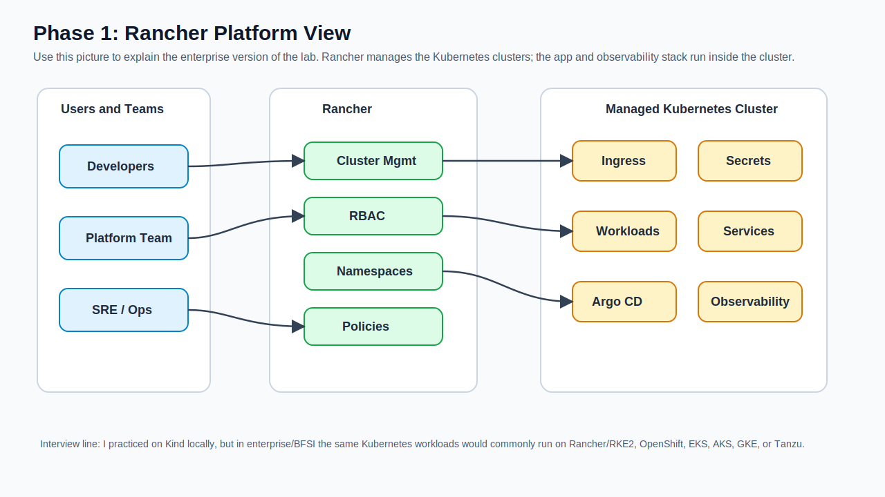
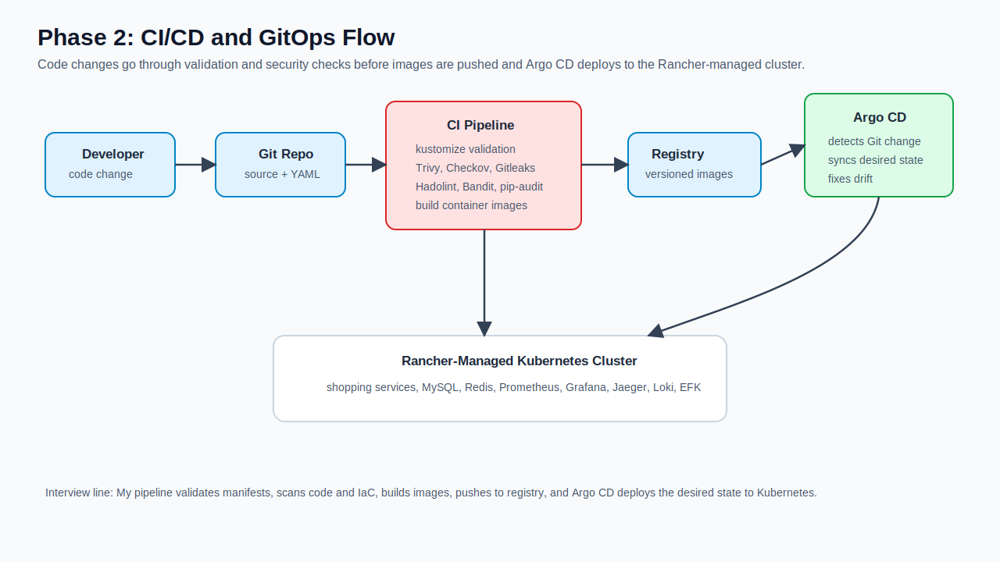
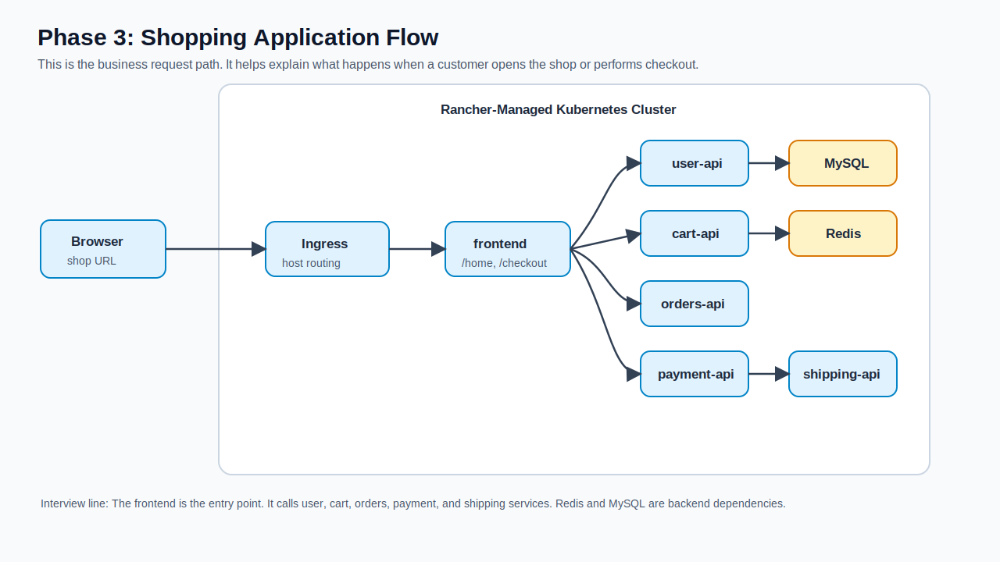
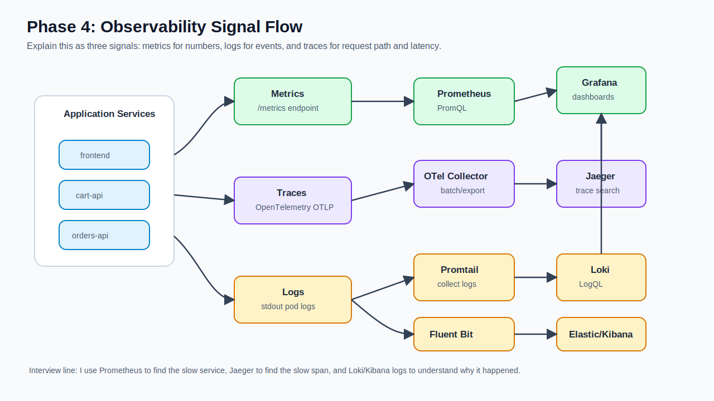
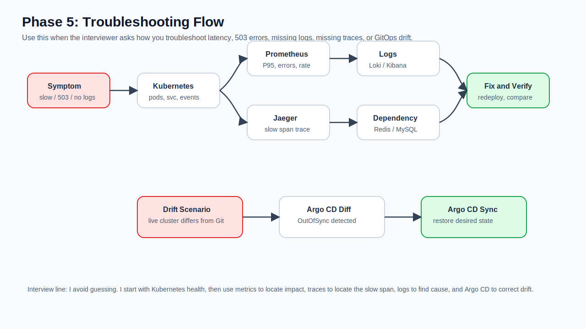

# Rancher Phase-by-Phase Project Diagrams

These diagrams explain the same project as an enterprise-style Rancher-managed Kubernetes flow.

Use this interview line:

```text
I used Kind for local practice because it is lightweight, but in enterprise/BFSI the same Kubernetes manifests and observability design can run on a Rancher-managed Kubernetes platform such as RKE2. Rancher manages clusters, access, namespaces, policies, and operational visibility.
```

## Phase 1: Rancher Platform View



Explain:

```text
Rancher is the platform layer used by platform teams to manage Kubernetes clusters. Developers, platform teams, and SREs access clusters through controlled RBAC. The shopping app and observability stack run inside the managed Kubernetes cluster.
```

## Phase 2: CI/CD and GitOps Flow



Explain:

```text
Code goes to Git. CI validates manifests, scans code and YAML, builds images, and pushes them to a registry. Argo CD watches Git and deploys the desired state to the Rancher-managed cluster.
```

## Phase 3: Shopping Application Flow



Explain:

```text
Traffic enters through ingress and reaches the frontend. The frontend calls user-api, cart-api, orders-api, payment-api, and shipping-api. Redis supports cart data, and MySQL supports user-style relational data.
```

## Phase 4: Observability Flow



Explain:

```text
Each service emits metrics, logs, and traces. Prometheus collects metrics, Jaeger shows traces through OpenTelemetry Collector, and Loki/EFK collect logs. Grafana is the main place to view dashboards and troubleshoot.
```

## Phase 5: Troubleshooting and Drift Handling



Explain:

```text
For latency or 503 issues, I start with Kubernetes health, then metrics, traces, logs, and dependencies. For drift, Argo CD detects OutOfSync state and syncs the cluster back to the desired state in Git.
```

## Short Interview Story

```text
I can explain the project in five phases. First, Rancher manages the Kubernetes environment. Second, CI/CD validates, scans, builds, and GitOps deploys the application. Third, the shopping app receives traffic through ingress and calls multiple backend services. Fourth, observability collects metrics, logs, and traces using Prometheus, Loki/EFK, OpenTelemetry, Jaeger, and Grafana. Fifth, troubleshooting uses Kubernetes commands, PromQL, traces, logs, dependency checks, and Argo CD sync for drift.
```
